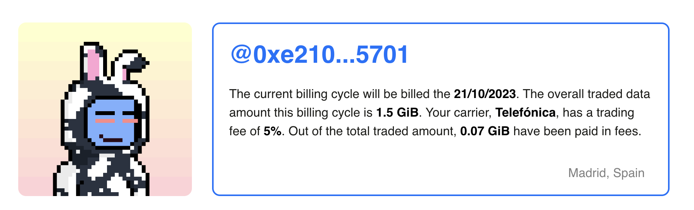
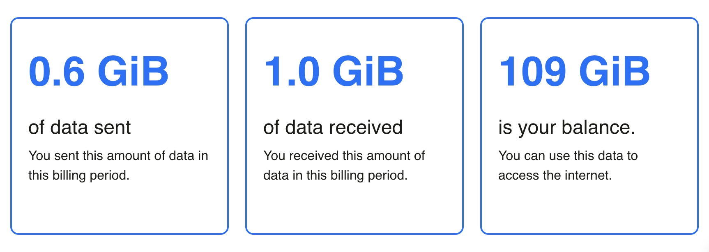
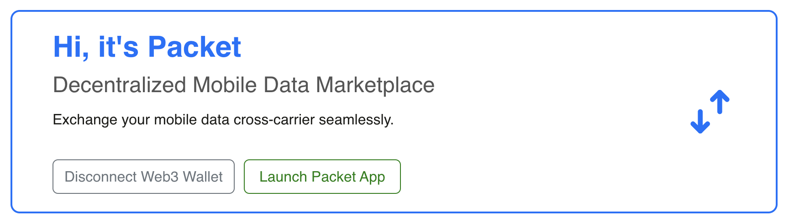
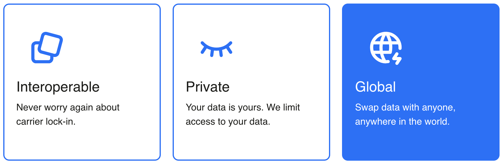
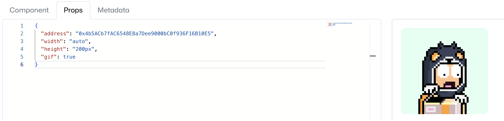

# Packet

A decentralized Mobile Data Marketplace powered by
[`NEAR's BOS`](https://near.org) and the
[`Arthera Blockchain`](https://arthera.net).

This marketplace enables users to buy and sell mobile data in a decentralized
way. It allows users to **buy** and **swap** mobile data from other users, and
**sell** their own mobile data to other users.

Swapping data is a new concept that allows users to exchange their data with
other users, without worrying about the Carrier. This is possible thanks to the
partnerships between them, allowing for a **small** fee to be charged for the
exchange.

# Contents

- [Features](#features)
- [Getting Started](#getting-started)
- [Custom BOS components](#custom-bos-components)
- [Interaction with the Arthera Blockchain](#interaction-with-the-arthera-blockchain)
- [Feedback](#feedback)
- [Extras](#extras)

# Features

- [x] Immutable React components stored on the blockchain
- [x] Custom `BOS` implementation
- [x] Interaction from NEAR's `BOS` components with the Arthera Blockchain
- [x] Production ready smart contracts

# Getting Started

1. Clone the repo

```sh
git clone git@github.com:Jabolol/packet.git .
```

2. Install dependencies

```sh
yarn
```

3. Start the development server

```sh
yarn dev
```

4. Fetch the `BOS` components (you'll need to have `bos-cli` installed)

```sh
ID=c5d50293c3a3ed146051462e6e02e469acda10b517bfffeb3d34652076f0cb7c
cd components
bos components download $ID network-config mainnet
```

# Custom BOS components

This project uses `multiple` custom, reusable `BOS` components, built from the
ground up for this project. All the components are open source and stored on the
blockchain. They can be `forked` from
[here](https://near.org/near/widget/ProfilePage?accountId=c5d50293c3a3ed146051462e6e02e469acda10b517bfffeb3d34652076f0cb7c&tab=apps)

- [`AppHero`](./components/src/AppHero.jsx): The hero section of the app itself,
  the main dashboard. Dynamically gets the user address and displays
  miscelaneous data. It maps the ethereum address to a `Yaypeg` NFT and displays
  it as an avatar dynamically.



- [`DataWidget`](./components/src/DataWidget.jsx): A widget that displays a
  numeric value and a label. It's used to display the amount of data the user
  has available and the amount of data the user has sold, for instance.



- [`Hero`](./components/src/Hero.jsx): The hero section of the landing page. It
  enables users to connect their wallet and displays a brief description of the
  app.



- [`ImageWidget`](./components/src/ImageWidget.jsx): A widget that displays an
  image and a label. It's used to display an icon instead of a number, to show
  an abstract concept.



- [`Yaypeg`](./components/src/Yaypeg.jsx): A component that displays a
  [`Yaypeg`](https://yaypeg.com) NFT. It's used to display the user's avatar.
  Supports multiple options such as `gif` and `illustration`



# Interaction with the Arthera Blockchain

The `BOS` components interact with the Arthera Blockchain using custom hooks
created with `wagmi`. The hooks are:

- [`useBuyData`](./src/hooks/useBuyDataTokens.tsx): A hook that enables the user
  to buy `DataTokens` from the Arthera Blockchain. It uses the `buyData` method.

- [`useUserBalance`](./src/hooks/useUserBalance.tsx): A hook that enables the
  user to get their balance of their account from the Arthera Blockchain. It
  uses the `balanceOf` method.

- [`useHistory`](./src/hooks/useRecentPurchases.tsx): A hook that enables the
  user to get their history of transactions from the Arthera Blockchain. It
  listens for the `tokenPurchased` events.

- [`useTotalUsers`](./src/hooks/useTotalUsers.tsx): A hook that enables the user
  to get the all the user IDs registered in the smart contract. It uses the
  `totalUsers` method.

# Feedback

NEAR's BlockChain OS is a new technology, and being pioneers in this field is
difficult yet rewarding. Not everything worked at the first try, and we had to
make some changes to the `BOS` components to make them work. Nonetheless, once
we got the hang of it, it was a breeze to work with.

The `BOS` components are a great way to build reusable components that can be
used in multiple projects. They are easy to use and easy to deploy. The
possibilities are endless.

One way to improve the experience would be to have TypeScript support, implement
dark mode in the `sandbox` editor, and have another way to deploy the components
without using the private keys but a expiring token instead.

When it cames to the Arthera Blockchain, we had to make some changes to the
smart contracts to make them work with the `BOS` components. Apart from that,
the integration was seamless. Nothing broke, and everything worked as expected!

# Extras

I encountered a problem when trying to deploy the `BOS` components. `useState`
and `useEffect` weren't working for me! After having a chat on NEARs Discord, I
realized that the `bos-gateway` template was heavily outdated.

In order to spare someone else the trouble of finding out what was wrong, I
created a Pull Request to update the template. You can find it here:
https://github.com/near-examples/bos-gateway/pull/3. No matter how small the
change is, it can make a difference!
